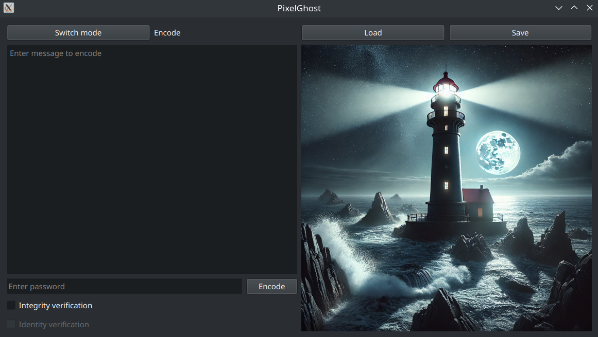

# PixelGhost

**PixelGhost** is a secure steganography tool that conceals text within images using a password-seeded randomization algorithm.

Unlike traditional LSB (Least Significant Bit) steganography which fills pixels sequentially, PixelGhost uses a **Pseudo-Random Number Generator (PRNG)** seeded by the user's password. This scatters the data across the image in a chaotic, deterministic pattern, making the hidden message statistically indistinguishable from noise and undecipherable without the specific password.

---

## Interface



---

## Key Features

* **Seeded Pixel Shuffling:** Data is not stored sequentially. The pixel order is determined by a generic hash of your password, effectively turning the image coordinates into a symmetric key.
* **Integrity Verification:** Uses **SHA-256** hashing to embed a checksum. When decoding, the tool verifies that the message has not been corrupted or altered.
* **Identity Signing:** Optional **HMAC** (Hash-based Message Authentication Code) signing ensures the message was created by a holder of the specific password, preventing spoofing.
* **Custom Packet Protocol:** Implements a binary packet structure with headers, payloads, and status flags to manage data streams dynamically.
* **Lossless Handling:** Built on OpenCV and NumPy to handle PNG bit-manipulation without compression artifacts destroying the data.

---

## Installation/Quick Start

1.  **Clone the repository:**
    ```bash
    git clone https://github.com/Koutnas/PixelGhost.git
    cd PixelGhost
    ```
2. **Create and activate venv**
    ```bash
    python -m venv .venv
    source .venv/bin/activate
    ```
3. **Install dependencies**
    ```bash
    pip install -r requirements.txt
    ```
4. **Run**
    ```bash
    python main.py
    ```
---

### Encoding a Message
1.  Select a source image (e.g., from the `resources/` folder).
2.  Enter your secret message.
3.  **Set a Password:** This is crucial. It generates the "Seed" for the pixel map.
4.  *(Optional)* Check **Integrity verification** to add a SHA-256 hash.
5.  *(Optional)* Check **Identity verification** to sign the message with HMAC.
6.  Save the resulting image.

### Decoding a Message
1.  Load the encoded image.
2.  **Enter the Password:** If the password matches the one used during encoding, the PRNG will reconstruct the correct pixel path and reveal the text.
3.  The tool will extract the text and display the status of the **Integrity** and **Identity** checks (Match/Mismatch).
---

## How It Works

Standard steganography hides data in pixels $P_1, P_2, P_3...$ sequentially. This creates a predictable pattern of modified bits at the top of the image. PixelGhost improves this using a coordinate shuffle. It also doesn't just hide raw text; it encapsulates data into a structured binary packet before embedding.

### 1. The Data Packet
Every message is constructed as a binary stream before encryption:

```text
+----------------+----------------+--------------------------+------------------+-------+
|  Length Header |  Message Body  |  SHA-256 Hash (Optional) |  HMAC (Optional) | Flags |
|    32 bits     |    Variable    |         256 bits         |     256 bits     | 2 bits|
+----------------+----------------+--------------------------+------------------+-------+
```
**Header:** Defines the total message length.

**Flags:**

    00: Raw Text
    01: Text + Integrity Hash
    11: Text + Integrity Hash + HMAC Signature

### 2. The Coordinate Shuffle
1.  **Hashing:** The user's password is hashed to create an integer Seed ($S$).
2.  **Coordinate Generation:** A PRNG initialized with $S$ generates a sequence of unique pixel coordinates $(x, y)$.
    $$Sequence = RNG(Seed) \rightarrow \{(x_{45}, y_{12}), (x_{3}, y_{99}), ...\}$$
3.  **Embedding:** The binary data of the message is distributed into the Least Significant Bits of the pixels in *that specific random order*.

This acts as a symmetric key algorithm where the "key" is the geometric distribution of the data.

---

## Project Structure

```text
.
├── Documentation/       # PDF documentation
├── resources/           # Test images and assets
├── src/                 # Source code
│   ├── main.py          # Application Entry Point
│   ├── Stegui.py        # GUI(PyQt6)
│   ├── Stegui_logic.py  # Connector between GUI and Backend
│   ├── Encoder.py       # Core Encoding Logic
│   └── Decoder.py       # Core Decoding Logic
├── requirements.txt     # Python dependencies
└── README.md
```
## License
This project is licensed under the MIT License.
## Author
Ondřej Koutník